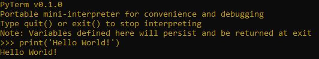
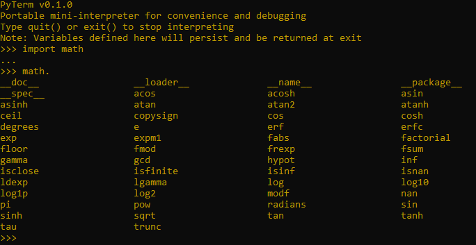

# ptty


Python Terminal (Tiny)

A simple but powerful terminal for Python.



Meant to be imported and used inline similar to [ipdb](<https://github.com/gotcha/ipdb>):

```python
>>> def foo():
...     a = 3
...     import ptty; ptty()  # Launch Python REPL
...     print(a)
```

In situations where exceptions are used as a means of complex flow control (i.e. within a Pytest unit test invocation), being able to quickly import a funcional terminal is very convenient.

To print out dot-completion information, type any valid name followed by a period character ('.') and hit <enter>. This will print out the member methods and fields for that object.

